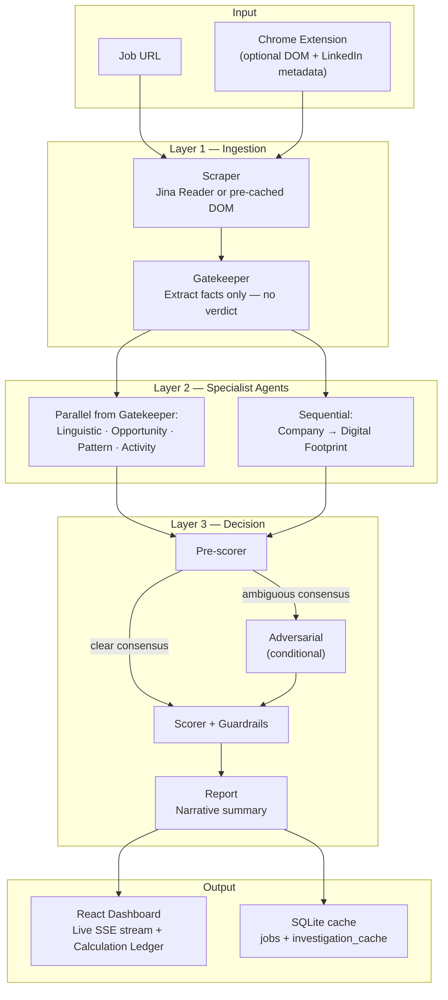
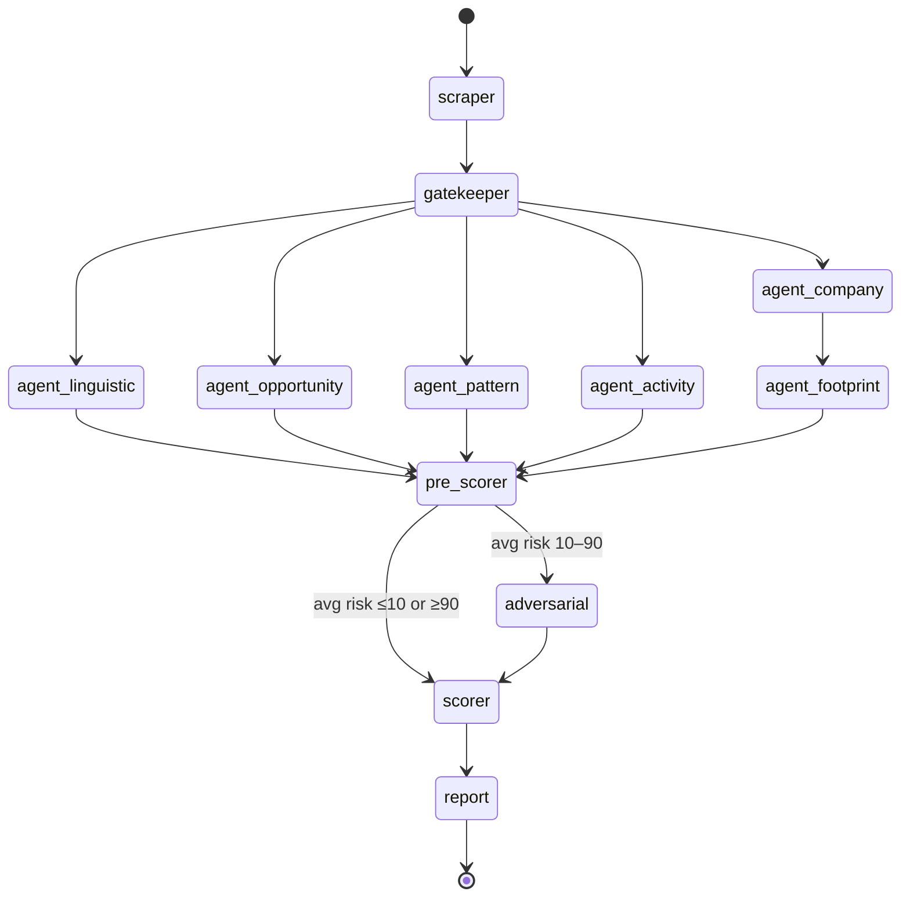
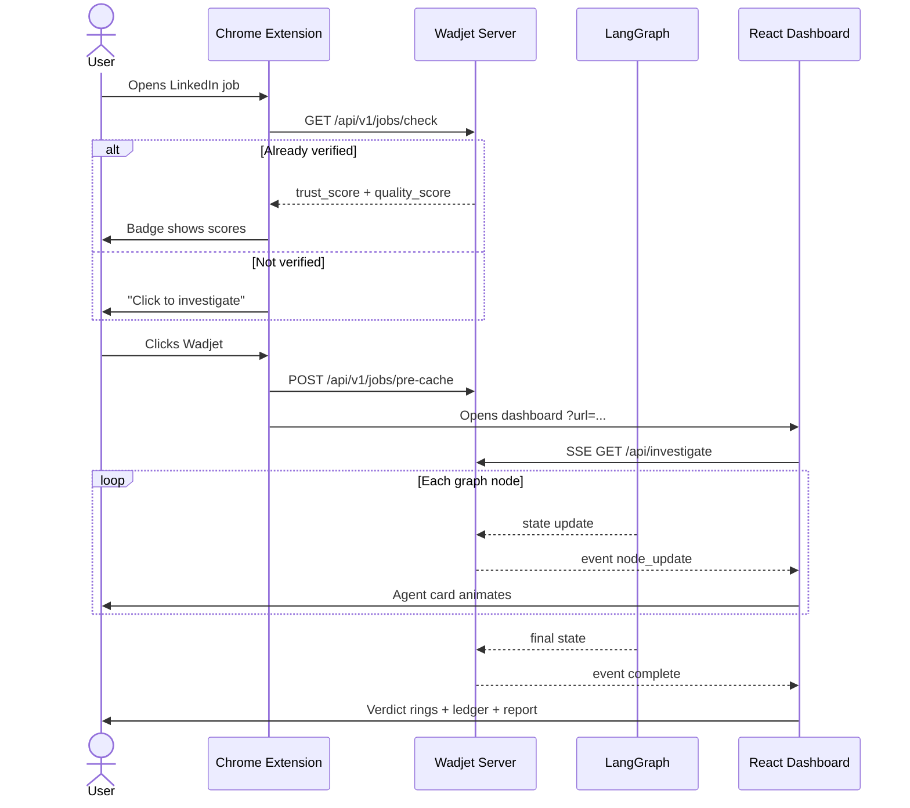

# Wadjet v1.0 — Remote Job Quality Identifier & Job Portal

<p align="center">
  <strong>Find real remote jobs. Skip the scams. See the math.</strong><br/>
  Multi-agent AI verification for remote job listings — with full scoring transparency.
</p>

<p align="center">
  <a href="#what-problem-does-wadjet-solve">Use Case</a> ·
  <a href="#how-wadjet-identifies-good-quality-jobs">Quality Scores</a> ·
  <a href="#how-the-agentic-investigation-works">Agents</a> ·
  <a href="#point-calculations">Scoring Math</a> ·
  <a href="#architecture">Architecture</a> ·
  <a href="#quick-start">Quick Start</a> ·
  <a href="#partner-portal-api">Partner API</a>
</p>

---

## What problem does Wadjet solve?

Remote job boards — especially LinkedIn — are flooded with listings that are hard to evaluate quickly:

| Problem | What it looks like | Why it hurts job seekers |
|---------|-------------------|--------------------------|
| **Scams** | Advance-fee fraud, reshipping, identity theft, MLM disguised as jobs | Wasted time, financial loss, stolen data |
| **Ghost listings** | Old reposts, no real recruiter, fake applicant counts | Applications go nowhere |
| **Bait-and-switch "remote"** | Title says remote, description requires office days or relocation | Misleading expectations |
| **Low-quality but real roles** | Below-market pay, no salary band, weak hiring process | Legitimate but not worth pursuing |

A thorough human check for one listing takes **15–30 minutes**: read the full description, Google the company, check WHOIS on contact domains, compare pay to market, verify the application channel, assess posting freshness. Job seekers apply to dozens of roles. Scammers exploit that asymmetry.

**Wadjet automates that investigation** — not with a single chatbot verdict, but with a **multi-agent pipeline** that collects evidence, applies fixed scoring rules, and shows every calculation in the UI.

### Who is it for?

- **Job seekers** — paste a URL or use the Chrome extension on LinkedIn; get Legitimacy + Remote Quality scores with a full audit trail
- **Browsers of verified roles** — explore the **Verified Remote Roles** portal (Legitimacy ≥ 80, Remote Quality ≥ 60)
- **Partner job boards** — integrate via the **Partner Portal API** to badge or filter listings Wadjet has already checked

---

## How Wadjet identifies good quality jobs

Wadjet separates two questions that other tools often conflate:

| Score | UI label | Question |
|-------|----------|----------|
| **Legitimacy** | 0–100 | Is this remote role **real and safe to apply to**? |
| **Remote Quality** | 0–100 | If it's real, is it a **good remote opportunity** worth pursuing? |

A job can score high on one and low on the other:

- **High Legitimacy, low Quality** — Real company, but poor pay transparency or weak hiring process
- **Low Legitimacy, high Quality** — Great-sounding salary text, but scam signals dominate (common in fraud listings)

### Verdict tier (apply / investigate / walk away)

Derived from **Legitimacy only** (Remote Quality does not change the tier):

| Tier | Legitimacy | Meaning |
|------|------------|---------|
| **Verified** | ≥ 75 | High confidence — likely legitimate |
| **Caution** | 40–74 | Mixed signals — investigate further |
| **Warning** | < 40 | High risk — likely scam or serious red flags |

**Guardrails** can cap the tier downward (never upward) when hard red flags fire — e.g. PII requested, known scam template matched, apply-via-Telegram — even if the numeric Legitimacy score looks fine.

### What counts as a "good" job in the portal?

Jobs appear in the **Verified Remote Roles** portal and partner feeds when:

```
Legitimacy ≥ 80  AND  Remote Quality ≥ 60
```

That bar filters out scams and low-quality listings while surfacing roles Wadjet has investigated with strong signals on both safety and opportunity quality.

### Why not just ask ChatGPT?

| Dimension | Single LLM chat | Wadjet |
|-----------|-----------------|--------|
| Evidence | Training data + maybe browsing | Listing text + Google Search + WHOIS + LinkedIn DOM metadata |
| Scoring | Subjective model judgment | **Deterministic rubrics** — same flags → same numbers |
| Audit trail | Opaque verdict | Full `calculation` payload in the UI ledger |
| Scam templates | Unstructured guess | Dedicated Pattern agent + hard guardrails |
| Domain age | Often hallucinated | WHOIS lookup in code |
| Counter-evidence | None | Adversarial agent on ambiguous cases |
| Repeat cost | Full price every time | SQLite LLM + investigation cache |

> **Design principle:** *LLMs propose structured evidence. Code decides the numbers.*

---

## How the agentic investigation works

Wadjet is built on **LangGraph** — a directed graph of specialist nodes. Each node is an "agent" with a narrow job. They do not vote informally; they return **structured flags** that TypeScript rubrics convert into scores.

### End-to-end flow



### LangGraph node sequence




### What each agent does

Every agent follows the same internal pattern:

```
Prompt → Gemini (structured or grounded) → Zod validation → Rubric → { riskScore, qualityScore, scoreBreakdown }
```

| Agent | Primary question | LLM type | Legitimacy weight | Quality weight |
|-------|------------------|----------|-------------------|----------------|
| **Gatekeeper** | What are the facts? (title, pay, contact, requirements) | Structured | — | — |
| **Linguistic** | Scam language? Async/remote culture signals? | Structured | 20% | 10% |
| **Company** | Does the employer exist? Layoffs? Funding? | Grounded search | 25% | 25% |
| **Opportunity** | Fair pay vs market? Truly 100% remote? | Grounded + structured | 15% | 35% |
| **Digital Footprint** | Trustworthy domain/email? | Structured + WHOIS | 15% | — |
| **Pattern** | Known scam template (advance-fee, reshipping…)? | Structured | 20% | — |
| **Activity** | Real hiring process? ATS vs Telegram? | Structured + ATS detector | 5% | 30% |
| **Adversarial** | Counter-evidence when consensus is ambiguous | Grounded search | ±20 risk adj. | — |

#### Agent highlights

**Linguistic** — Detects urgency, PII requests, money-first framing. PII request alone adds **+50 scam risk** and triggers a Warning guardrail.

**Company** — Uses Google Search with citations. Starts from skeptical baseline; subtracts risk as evidence accumulates. Major layoffs in 90 days add risk and cap tier to Caution.

**Opportunity** — Compares salary to grounded market median. Flags bait-and-switch remote (`isGenuineRemote = is100PercentRemote && !hasInOfficeRequirement`).

**Digital Footprint** — WHOIS age is injected as fact (LLM cannot invent it). Domain < 30 days → +80 risk. Resolves **employer domain**, not LinkedIn/Indeed hostnames.

**Pattern** — Classifies against known templates. Template match → **+90 risk** + Warning guardrail.

**Activity** — Neurosymbolic overrides: Workday/Greenhouse hostname forces `usesStandardATS=true`; Telegram/WhatsApp forces unprofessional channel. Uses LinkedIn-only metadata (poster, applicants, posted age) from the extension when available.

**Adversarial** — Skipped when average agent risk ≤ 10 or ≥ 90. Otherwise runs a counter-search and applies a **−20 to +20** adjustment to final scam risk.

### Live streaming to the dashboard

Investigations stream over **Server-Sent Events** (`GET /api/investigate?url=...`). As each agent completes, the React dashboard updates agent cards in real time. The final event includes scores, tier, guardrails, narrative report, and the full `calculation` object for the **Calculation Ledger**.



> **Deep agent reference:** [docs/AGENTS.md](docs/AGENTS.md)

---

## Point calculations

The AI **never outputs the final score directly**. Agents return boolean flags and enums; **fixed rubrics in TypeScript** convert them to points. The scorer aggregates with fixed weights. This is why the Calculation Ledger can show every step.

> **Plain-English guide:** [docs/SCORES_EXPLAINED.md](docs/SCORES_EXPLAINED.md)  
> **Worked examples & guardrail IDs:** [docs/SCORING.md](docs/SCORING.md)

### Score 1: Legitimacy (0–100)

Legitimacy is the inverse of **scam risk**:

```
raw scam risk   = Σ (agent riskScore × weight)
final scam risk = clamp(raw scam risk − adversarialAdjustment, 0, 100)
Legitimacy      = 100 − round(final scam risk)
```

**Agent weights for scam risk / Legitimacy:**

| Agent | Weight | Max contribution if agent = 100 |
|-------|--------|-----------------------------------|
| Company | 25% | 25 pts |
| Linguistic | 20% | 20 pts |
| Pattern | 20% | 20 pts |
| Opportunity | 15% | 15 pts |
| Footprint | 15% | 15 pts |
| Activity | 5% | 5 pts |

Each agent's internal rubric maps flags to points, capped at 100. Example: Linguistic `hasPiiRequest` → **+50 risk** inside that agent's rubric.

**Adversarial adjustment** (when run):

- Positive adjustment → lowers scam risk → **raises Legitimacy**
- Negative adjustment → raises scam risk → **lowers Legitimacy**
- Skipped when average agent risk is already < 10 or > 90

### Score 2: Remote Quality (0–100)

Quality **starts at 0** and **adds points** for strong remote-opportunity signals:

```
raw quality      = Σ (agent qualityScore × weight)
Remote Quality   = round(clamp(raw quality, 0, 100))
```

**Only four agents contribute to quality** (Footprint and Pattern detect fraud, not job quality):

| Agent | Weight | What "quality" means |
|-------|--------|----------------------|
| Opportunity | 35% | Pay vs market, salary disclosed, genuine remote, realistic requirements |
| Activity | 30% | Standard ATS, interview stages, credible poster, fresh posting |
| Company | 25% | Reviews, news, stable funding |
| Linguistic | 10% | Async / remote-culture language |

**Example quality calculation:**

| Agent | Quality score | × Weight | Contribution |
|-------|---------------|----------|--------------|
| Opportunity | 60 | 35% | 21.0 |
| Activity | 40 | 30% | 12.0 |
| Company | 50 | 25% | 12.5 |
| Linguistic | 10 | 10% | 1.0 |
| **Total** | | | **46.5 → 47** |

Remote Quality ≈ **47** — employer looks real, but hiring process and pay transparency are weak.

### Guardrails (tier caps)

Guardrails fire **after** the numeric Legitimacy is computed. They **cap the verdict tier downward** but **do not change the Legitimacy number**.

| Guardrail | Caps tier to | Trigger (simplified) |
|-----------|--------------|---------------------|
| PII / upfront payment | Warning | SSN, bank info, or payment requested |
| Scam template matched | Warning | Advance-fee, reshipping, etc. |
| Free email + young domain | Warning | Gmail contact + domain < 90 days |
| Unprofessional channel | Caution | Telegram, WhatsApp, random Google Form |
| Brand-new domain (< 30 days) | Caution | WHOIS age |
| Not 100% remote | Caution | Hidden in-office or relocation requirement |
| Company not verifiable | Caution | No proof of legal existence |
| Major layoffs (90 days) | Caution | Significant layoff news |

If multiple guardrails fire, the **strictest cap wins** (Warning beats Caution).

**Example mismatch (intentional):** Legitimacy = 84 (score band says Verified), but "Apply via Telegram" guardrail fires → **final tier = Caution**. The UI shows an amber verdict-cap banner and dual tier markers.

### Rubric transparency

Every rule in `server/src/rubrics/index.ts` emits a `ScoreRule`:

```typescript
interface ScoreRule {
  label: string;      // Human-readable rule name
  fired: boolean;     // Did it trigger this run?
  points: number;     // Actual contribution
  potential: number;  // What it would contribute if fired
  kind: 'risk' | 'quality';
}
```

These populate **Score Math** in agent modals and the **Calculation Ledger** in the dashboard.

---


### Technology stack

| Layer | Technology |
|-------|------------|
| LLM | Google Gemini (`gemini-2.5-flash-lite` default) |
| Orchestration | LangGraph (`@langchain/langgraph`) |
| Backend | Node.js, Express 5, TypeScript, tsx |
| Validation | Zod 4 + Gemini `responseSchema` |
| Database | better-sqlite3 (WAL mode) |
| Domain intel | whoiser |
| Frontend | React 19, Vite 8, Recharts |
| Extension | Chrome Manifest V3 |
| Scraping fallback | Jina Reader |


---

## Quick Start

### Prerequisites

- Node.js 18+
- [Google AI Studio](https://aistudio.google.com/apikey) API key
- Chrome (for extension)

### Install & run

```bash
git clone git@github.com:Arrow66/wadjet.git
cd wadjet

cd server && npm install
cd ../frontend && npm install
```

Create `server/.env`:

```env
GEMINI_API_KEY=your_key_here
GEMINI_MODEL=gemini-2.5-flash-lite
MOCK_MODE=false
GEMINI_MAX_CONCURRENT=1
GEMINI_MIN_DELAY_MS=4000
PORT=3000

# Optional — partner API auth in production
# PARTNER_API_KEY=your_secret_key
# FRONTEND_URL=http://localhost:5173
```

```bash
# Terminal 1 — backend
cd server && npm run dev
# → http://127.0.0.1:3000

# Terminal 2 — frontend
cd frontend && npm run dev
# → http://localhost:5173
```

**Load extension:** `chrome://extensions` → Developer mode → Load unpacked → select `extension/`


---

## Partner Portal API

External job boards can check whether Wadjet has verified a listing.

**Base URL:** `http://127.0.0.1:3000/api/v1/portal`

When `PARTNER_API_KEY` is set, send `X-API-Key: <key>` or `?api_key=<key>`. When unset, routes are open (local dev).

| Method | Path | Purpose |
|--------|------|---------|
| `GET` | `/` | API discovery + portal thresholds |
| `GET` | `/check?url=&title=&company=` | Look up a single job |
| `POST` | `/check/batch` | Check up to 25 jobs |
| `GET` | `/jobs?limit=50&offset=0` | List verified portal jobs |
| `GET` | `/jobs/:id` | Get one job by ID |
| `POST` | `/investigate` | Run full investigation (uses cache when available) |

**Lookup order:** exact URL → title+company fingerprint → investigation cache.

**Example:**

```bash
curl "http://127.0.0.1:3000/api/v1/portal/check?url=https://linkedin.com/jobs/view/123"
```

```json
{
  "success": true,
  "found": true,
  "verified_for_portal": true,
  "match": {
    "legitimacy_score": 90,
    "quality_score": 63,
    "match_type": "url",
    "dashboard_url": "http://localhost:5173/?url=..."
  }
}
```

A job is `verified_for_portal: true` when Legitimacy ≥ 80 and Remote Quality ≥ 60.

---

## API Reference

### Investigation (SSE)

```
GET /api/investigate?url={encoded_url}
Accept: text/event-stream
```

Events: `status`, `node_update`, `complete`, `error`

### Jobs (extension + frontend portal)

```
GET  /api/v1/jobs
GET  /api/v1/jobs/check?url=&title=&company=
POST /api/v1/jobs/pre-cache
```

### Utility

| Method | Path | Purpose |
|--------|------|---------|
| `GET` | `/health` | Health check |
| `POST` | `/api/clear-cache` | Wipe SQLite caches |
> **Extension protocol & SSE events:** [docs/FRONTEND.md](docs/FRONTEND.md)

---

## Chrome Extension

On LinkedIn job pages, the extension:

1. Injects a Wadjet badge next to the job title
2. Checks if the job is already verified (`GET /api/v1/jobs/check`)
3. On first click: scrapes DOM + LinkedIn-only metadata → `POST /api/v1/jobs/pre-cache` → opens dashboard
4. Shows Trust/Quality tooltip when previously verified

**Metadata only the extension can capture:**

| Field | Why it matters |
|-------|----------------|
| `postedAgoText` | Freshness, ghost listing detection |
| `isRepost` | −20 quality penalty |
| `applicantCountText` | Demand signal |
| `jobPoster` | Poster credibility |

---

## Database & caching

SQLite file: `server/cache.sqlite`

| Table | Purpose |
|-------|---------|
| `llm_cache` | Identical Gemini prompt → skip API call |
| `investigation_cache` | Full graph state by normalized URL |
| `jobs` | Verified listings for portal + extension badge |

**Clear all caches:**

```bash
curl -X POST http://127.0.0.1:3000/api/clear-cache
```

---

## Environment variables

| Variable | Default | Description |
|----------|---------|-------------|
| `GEMINI_API_KEY` | — | Required unless `MOCK_MODE=true` |
| `GEMINI_MODEL` | `gemini-2.5-flash-lite` | Model for all agent calls |
| `MOCK_MODE` | `false` | Serve cache only; no API calls |
| `GEMINI_MAX_CONCURRENT` | `2` | Max simultaneous Gemini calls |
| `GEMINI_MIN_DELAY_MS` | `2000` | Min ms between call starts |
| `PARTNER_API_KEY` | — | Optional auth for `/api/v1/portal` |
| `FRONTEND_URL` | `http://localhost:5173` | Dashboard links in portal API |
| `PORT` | `3000` | Server port |

---

## Troubleshooting

| Symptom | Fix |
|---------|-----|
| `429 RESOURCE_EXHAUSTED` | Wait, enable billing, or `MOCK_MODE=true` |
| Investigation hangs | Reduce `GEMINI_MAX_CONCURRENT`; increase `GEMINI_MIN_DELAY_MS` |
| Extension badge missing | Reload extension; check LinkedIn URL matches `*/jobs/*` |
| Portal API 401 | Set `X-API-Key` matching `PARTNER_API_KEY` |

**Inspect cache:**

```bash
sqlite3 server/cache.sqlite "SELECT title, company, trust_score, quality_score FROM jobs ORDER BY created_at DESC LIMIT 5;"
```

## Documentation index

| Doc | Contents |
|-----|----------|
| [docs/SCORES_EXPLAINED.md](docs/SCORES_EXPLAINED.md) | Legitimacy, Remote Quality, guardrails — no engineering background needed |
| [docs/AGENTS.md](docs/AGENTS.md) | Every agent's schema, rubric, and failure modes |
| [docs/SCORING.md](docs/SCORING.md) | Worked examples, guardrail IDs, hallucination mitigations |
| [docs/FRONTEND.md](docs/FRONTEND.md) | Extension protocol, SSE events, UI components |

---

## Summary

**Wadjet** treats remote job trust as an engineering problem:

- **Six specialist agents** extract structured evidence from listings and the live web
- **Deterministic rubrics** convert flags into numeric scores — reproducible and auditable
- **Neurosymbolic guardrails** cap verdicts when hard red flags fire
- **Adversarial validation** challenges ambiguous consensus
- **Full transparency** — every weight, rule, and cap visible in the Calculation Ledger
- **Partner API** — let other job portals badge or filter Wadjet-verified listings

**Verified remote roles. Transparent math. No black boxes.**

---

## License

ISC (see `package.json` in `server/` and `frontend/`).
